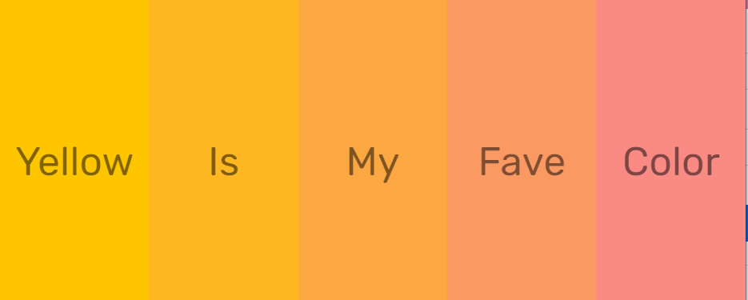
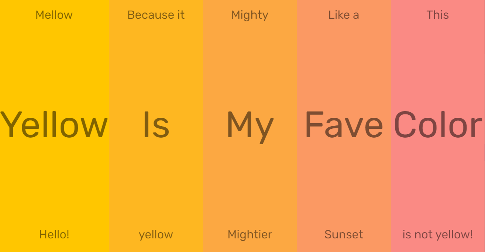

A cascading panel project using toggleActive/event listener js
      and blended color pallet onClick panels expand to see additional text
---

- manipulating bezier curve of panel a,b,c,d,e with css magic cubicBezierFunction
    with custom acceleration pattern points are x1,y1,x2,y2 bc curve is formed by 4points.

- this animates the panels and when you click a panel extra words appear and the panel expands with a smooth transition speed.

- coded this project using child selectors which limits adding any extras, but could easily add a class to each p tag to add extra text to panels.

screenshot of closed panels

---
screenshot of open transition.
you can be selective of which of the 5 panels to open they are individually clickable in both open/closed direction

